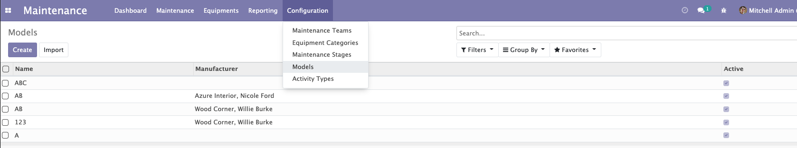
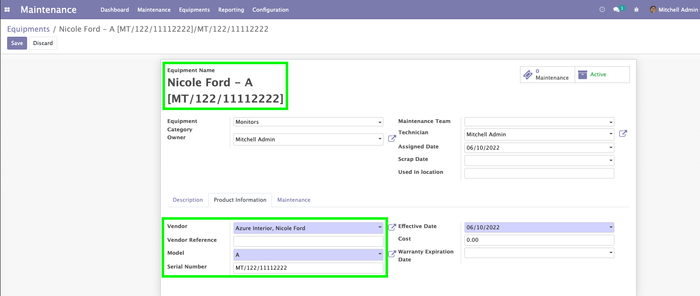

Maintenance Equipment Model
===========================
This module adds maintenance equipment model and compute name of maintenance equipment base on vendor, model and serial number.

New model: Maintenance Equipment Model

Make vendor and model required fields and compute maintenance equipment's name base on vendor, model and serial number.

Contributors
------------

* The `Numigi <https://numigi.com/r/home>`_ team is the contributor to this project. We help Quebec companies implement Odoo and Konvergo ERP.
* Komit (https://komit-consulting.com)