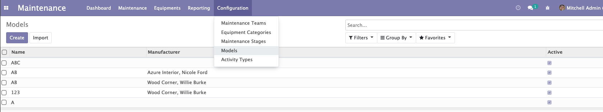

Maintenance Equipment Model
===========================
This module adds maintenance equipment model and compute name of maintenance equipment base on vendor, model and serial number

New model: Maintenance Equipment Model

Make vendor and model required fields and compute maintenance equipment's name base on vendor, model and serial number

Contributors
------------
* Numigi (tm) and all its contributors (https://bit.ly/numigiens)
* Komit (https://komit-consulting.com)

More information
----------------
* Meet us at https://bit.ly/numigi-com
